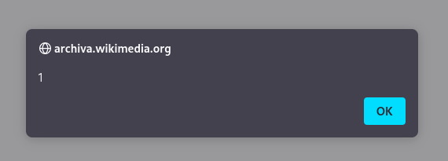

## Uncovering a Stored XSS Vulnerability in Apache Archiva (CVE-2023-28158)

2024-04-07<br/>
by [Sandro Bauer](https://sandr0.xyz)

⚠️ The project retired in February 2024.[^retired]

In March 2023, I got the opportunity to identify and report a stored XSS vulnerability in Apache Archiva 2.2.9.[^archiva] The vulnerability got awarded CVE-2023-28158.[^cve]

> Apache Archiva&trade; is an extensible repository management software that helps taking care of your own personal or enterprise-wide build artifact repository.<br/>
> \- <https://archiva.apache.org>

This blog post highlights the details of the vulnerability, its potential impact and the steps taken to address it.

### Stored XSS Vulnerability

The vulnerability was found in the `DefaultFileUploadService`.[^code] This method is responsible for saving user-uploaded files to a location supplied by the user.

We will use the following payload to explain the code flow:

```py
"http://{domain}/restServices/archivaUiServices/fileUploadService/save/internal/%20/%20/%20/file-name"

repositoryId: "internal"
groupId: "%20"
artifactId: "%20"
version: "%20"
packaging: "file-name"
```

When saving the file, `save` is called with the user supplied parameters.[^code-save] The parameters `groupId`, `artifactId`, `version` get trimmed. The only validation checks for path traversal payloads, while fully allowing HTML tags.[^code-valid]

When uploading, the contents of the file are irrelevant, since with CVE-2023-28158, the file path is used for XSS.

Source `DefaultFileUploadService.java#L278-L366`[^code-save]:

```java
@Override
public Boolean save( String repositoryId, String groupId, String artifactId, String version, String packaging,
                        boolean generatePom )
    throws ArchivaRestServiceException
{
    repositoryId = StringUtils.trim( repositoryId );
    groupId = StringUtils.trim( groupId );
    artifactId = StringUtils.trim( artifactId );
    version = StringUtils.trim( version );
    packaging = StringUtils.trim( packaging );

!!    checkParamChars("repositoryId", repositoryId);
!!    checkParamChars("groupId", groupId);
!!    checkParamChars("artifactId", artifactId);
!!    checkParamChars( "version", version);
!!    checkParamChars("packaging", packaging);

    [...]
}
```

Source `DefaultFileUploadService.java#L267-L275`[^code-check]:

```java
private void checkParamChars(String param, String value) throws ArchivaRestServiceException {
!!    if (!hasValidChars(value)) {
        ArchivaRestServiceException e = new ArchivaRestServiceException("Bad characters in " + param, null);
        [...]
        throw e;
    }
}
```

Source `DefaultFileUploadService.java#L254-L265`[^code-valid]:

```java
private boolean hasValidChars(String checkString) {
    if (checkString.contains(FS)) {
        return false;
    }
    if (checkString.contains("../")) {
        return false;
    }
    if (checkString.contains("/..")) {
        return false;
    }
    return true;
}
```

With default configurations in the internal repository, the file gets saved in:

```yaml
/archiva-data/repositories/internal/-.file-name
```

### Exploitation

The vulnerability gets triggered executing arbitrary JavaScript code on the victim's device the moment the WebDAV interface (repository view) is accessed, or accessing the repository view in the web app:

```yaml
http://{domain}/repository/internal/
http://{domain}/#rest-docs-archiva-rest-api/repository%2finternal%2f
```

In both views, the malicious file name gets rendered unsanitized in a table:

```java
"<tr><td><a class=\"file\" href=\"" + resourceName + "\">" + resourceName + "</a></td><td class=\"size\">..."
```

By carefully manipulating the uploaded files name, the user can inject malicious code. For instance:

```html
<tr><td><a class="file" href="-.">-.</a></td><td class="size">...
```

When one of the above links is accessed, the payload executes on the victim's browser in the context of the archiva app and displays the `alert` window.




### Privilege Escalation

Using this vulnerability, users with minimal permissions to upload files evaluate their privileges by stealing the cookies of privileged users.

Attackers can perform privilege escalation using a simple cookie extraction payload:

```html

```

The above payload allows attackers to discreetly extract the cookies of privileged users to their own server. In the payload, slashes (`/`) need to be escaped, since a file is created. `String.fromCharCode` can be used to escape them.

### Reporting, CTF, and Fixing

I decided to use it to create a 0-day web challenge for hxp CTF 2022.[^hxpctf] [^chall] This challenge was solved by 38 teams who successfully exploited the vulnerability to obtain the flag. Afterwards, I promptly reported the vulnerability to Apache, which was immediately addressed and fixed on 14.03.2023.[^fix]

To fix the issue, the provided parameters are now properly escaped:[^code-save-fix]:

```java
public Boolean save( String repositoryId, String groupId, String artifactId, String version, String packaging,
                        boolean generatePom )
    throws ArchivaRestServiceException
{
!!    repositoryId = StringEscapeUtils.escapeHtml( StringUtils.trim( repositoryId ) );
!!    groupId = StringEscapeUtils.escapeHtml( StringUtils.trim( groupId ) );
!!    artifactId = StringEscapeUtils.escapeHtml( StringUtils.trim( artifactId ) );
!!    version = StringEscapeUtils.escapeHtml( StringUtils.trim( version ) );
!!    packaging = StringEscapeUtils.escapeHtml( StringUtils.trim( packaging ) );

    checkParamChars("repositoryId", repositoryId);
    checkParamChars("groupId", groupId);
    checkParamChars("artifactId", artifactId);
    checkParamChars( "version", version);
    checkParamChars("packaging", packaging);

    [...]
}
```

Additionally, special HTML characters are checked in `hasValidChars`[^code-valid-fix]:

```java
private boolean hasValidChars(String checkString) {
    if (checkString.contains(FS)) {
        return false;
    }
    if (checkString.contains("../")) {
        return false;
    }
    if (checkString.contains("/..")) {
        return false;
    }
!!    if (checkString.contains("<")) {
!!        return false;
!!    }
!!    if (checkString.contains(">")) {
!!        return false;
!!    }
!!    if (checkString.contains("&")) {
!!        return false;
!!    }
    return true;
}
```

### Acknowledgment and CVE Accreditation

As a result of my disclosure and collaboration with the Apache Archiva team, I was officially accredited with CVE-2023-28158 on 29.03.2023.[^cve] [^maillist] This recognition highlights the community's commitment to securing open-source software.

### Conclusion

The discovery and subsequent resolution of CVE-2023-28158 in Apache Archiva emphasize the significance of continuous security assessments. By working together, we can ensure the safety and reliability of essential software systems for users worldwide.

### References

[^cve]: <https://www.cve.org/CVERecord?id=CVE-2023-28158>
[^fix]: <https://github.com/apache/archiva/commit/d62e81c7e75f617cf01d2a75952a2c857758f8c4>
[^hxpctf]: <https://2022.ctf.link>
[^maillist]: <https://lists.apache.org/thread/8pm6d5y9cptznm0bdny3n8voovmm0dtt>
[^archiva]: <https://archiva.apache.org>
[^code]: <https://github.com/apache/archiva/blob/056682167a9ef3edc5308f1387836352c0925177/archiva-modules/archiva-web/archiva-web-common/src/main/java/org/apache/archiva/web/api/DefaultFileUploadService.java>
[^chall]: <https://2022.ctf.link/internal/challenge/b2ca2268-f49f-4103-9943-2a417244a955>
[^code-save]: <https://github.com/apache/archiva/blob/056682167a9ef3edc5308f1387836352c0925177/archiva-modules/archiva-web/archiva-web-common/src/main/java/org/apache/archiva/web/api/DefaultFileUploadService.java#L278-L366>
[^code-check]: <https://github.com/apache/archiva/blob/056682167a9ef3edc5308f1387836352c0925177/archiva-modules/archiva-web/archiva-web-common/src/main/java/org/apache/archiva/web/api/DefaultFileUploadService.java#L267-L275>
[^code-valid]: <https://github.com/apache/archiva/blob/056682167a9ef3edc5308f1387836352c0925177/archiva-modules/archiva-web/archiva-web-common/src/main/java/org/apache/archiva/web/api/DefaultFileUploadService.java#L254-L265>
[^code-savefile]: <https://github.com/apache/archiva/blob/056682167a9ef3edc5308f1387836352c0925177/archiva-modules/archiva-web/archiva-web-common/src/main/java/org/apache/archiva/web/api/DefaultFileUploadService.java#L424-L570>
[^code-valid-fix]: <https://github.com/apache/archiva/blob/d62e81c7e75f617cf01d2a75952a2c857758f8c4/archiva-modules/archiva-web/archiva-web-common/src/main/java/org/apache/archiva/web/api/DefaultFileUploadService.java#L255-L275>
[^code-save-fix]: <https://github.com/apache/archiva/blob/d62e81c7e75f617cf01d2a75952a2c857758f8c4/archiva-modules/archiva-web/archiva-web-common/src/main/java/org/apache/archiva/web/api/DefaultFileUploadService.java#L288-L376>
[^retired]: <https://attic.apache.org/projects/archiva.html>